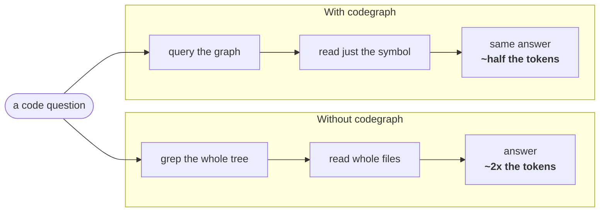
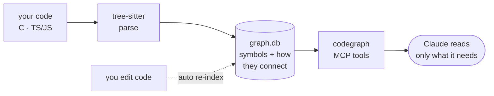

# codegraph

codegraph indexes your codebase into a structured graph of its symbols and how they
connect. Instead of grepping and reading whole files, Claude reads the exact slice it
needs from that graph — so it answers code questions using **up to half the tokens** a
session without it would spend, at the same accuracy (measured across held-out A/B
tests). Embedded, no daemon, nothing to compile. **Set it up once and forget it.**



## Contents
- [Install](#install)
- [Daily use](#daily-use)
- [What Claude can do](#what-claude-can-do)
- [Languages](#languages)
- [How it works](#how-it-works)
- [Notes](#notes)

## Install

Three lines, nothing compiles:

```
/plugin marketplace add kaleLetendre/codegraph
/plugin install codegraph@codegraph
/reload-plugins
```

## Daily use

Once, in any repo you work in:

```
/codegraph-init
```

That's the whole job. It builds the graph, points Claude at it, and keeps it current as
you edit — **set and forget**. From then on just talk to Claude normally ("where is X",
"what calls Y", "what breaks if I change Z", "how does A reach B") and it answers from
the graph, cheaper. Nothing else to run.

Rarely needed: `/codegraph-status` (health), `/codegraph-rebuild` (after a big refactor),
`/codegraph-remove` (uninstall from a repo).

## What Claude can do

| Tool | Answers |
|---|---|
| `find_symbol` | where something is defined |
| `get_source` | one symbol's body (not the whole file) |
| `trace_callees` / `trace_callers` | what it calls / who calls it — whole tree, one query |
| `trace_contract` / `path_between` | how code connects, across repos, via shared contracts |
| `query_sql` | read-only SQL for anything else |
| `graph_status` / `update_graph` | check freshness / refresh |

You don't call these — Claude does, automatically.

## Languages

**C** and **TypeScript / JavaScript** today. Adding Python, Java, etc. is small: drop in
the tree-sitter grammar plus two short rules (what counts as a definition, what counts as
a call). Everything downstream is language-agnostic.

## How it works



Tree-sitter parses your files into symbols and call sites and stores them in one
per-project SQLite file (`<project>/.codegraph/graph.db`). Calls resolve within a repo;
cross-repo links flow through shared API/contract nodes. Edits re-index a file at a time
via hooks, so the graph stays fresh without you touching it.

## Notes

- **Blind spots:** the graph is static and name-based, so it's blind to function-pointer /
  callback dispatch, string literals (route paths, JSON fields), and the C preprocessor;
  call resolution is heuristic. The tools carry these caveats so Claude verifies when it
  matters.
- **Stack:** WASM SQLite (`sql.js`) + tree-sitter, vendored in the repo so a clean install
  needs only Node — no compiler, no daemon. The graph file is gitignored. `npm test` runs a
  regression suite; see `DECISIONS.md` for the architecture rationale.
