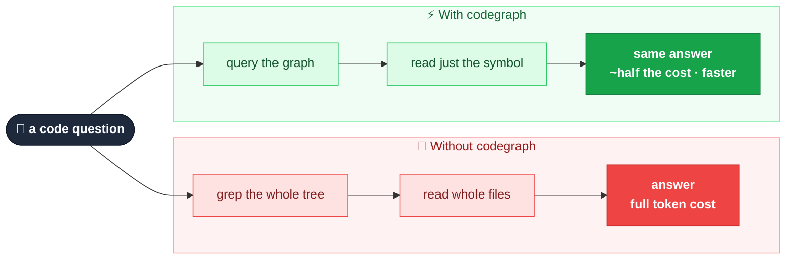
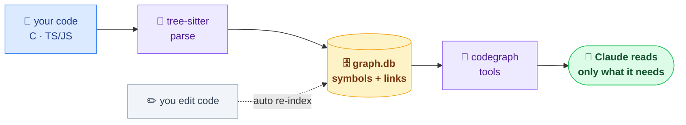

# codegraph

codegraph indexes your codebase into a structured graph of its symbols and how they
connect. Instead of grepping and reading whole files, Claude reads the exact slice it
needs from that graph — answering the same questions just as accurately for **about half
the tokens** (40–60% fewer in held-out A/B tests). Less to read also means **faster
answers and lower cost**. Embedded, no daemon, nothing to compile. **Set it up once and
forget it.**



## Contents
- [Install](#install)
- [Index a workspace (once)](#index-a-workspace-once)
- [What Claude can do](#what-claude-can-do)
- [Languages](#languages)
- [How it works](#how-it-works)

## Install

Three lines, nothing compiles:

```
/plugin marketplace add kaleLetendre/codegraph
/plugin install codegraph@codegraph
/reload-plugins
```

## Index a workspace (once)

Run once at the root of a **workspace** — a folder that can hold a single repo or many
side by side:

```
/codegraph-init
```

That's the whole job — **once per workspace, never again**. It finds every repo under
that root, indexes them into one graph, and links calls **across** repos through shared
API/contracts. It keeps itself current as you edit (set and forget). From then on just
talk to Claude normally ("where is X", "what calls Y", "what breaks if I change Z", "how
does A reach B") and it answers from the graph — cheaper and faster. Nothing else to run,
ever.

Rarely needed: `/codegraph-status` (health), `/codegraph-rebuild` (after a big refactor),
`/codegraph-remove` (uninstall from a workspace).

## What Claude can do

| Tool | Answers |
|---|---|
| `find_symbol` | where something is defined |
| `get_source` | one symbol's body (not the whole file) |
| `trace_callees` / `trace_callers` | what it calls / who calls it — whole tree, one query |
| `trace_contract` / `path_between` | how code connects, across repos, via shared contracts |
| `query_sql` | read-only SQL for anything else |
| `graph_status` / `update_graph` | check freshness / refresh |

You don't call these — Claude does, automatically.

## Languages

**C** and **TypeScript / JavaScript** today. Adding Python, Java, etc. is small: drop in
the tree-sitter grammar plus two short rules (what counts as a definition, what counts as
a call). Everything downstream is language-agnostic.

## How it works



Tree-sitter parses your files into symbols and call sites and stores them in one
per-workspace SQLite file (`<workspace>/.codegraph/graph.db`). Calls resolve within a
repo; cross-repo links flow through shared API/contract nodes — it was built and tested
on a real multi-repo workspace (four repos linked through shared contracts). Edits
re-index a file at a time via hooks, so the graph stays fresh without you touching it.

**Git is optional.** codegraph doesn't need it to work — it just walks the folder. When
git *is* present it uses it to spot what changed between sessions for cheap refreshes;
without it, codegraph still indexes everything and still re-indexes files as you edit
them.
