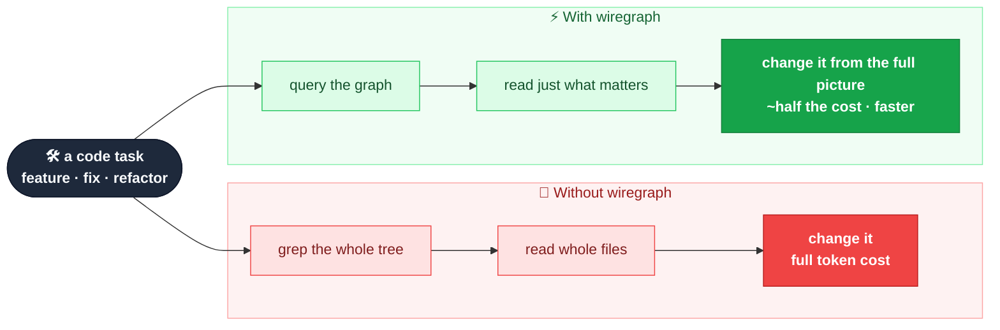
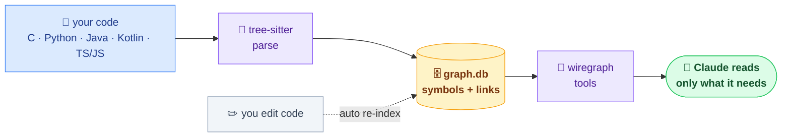
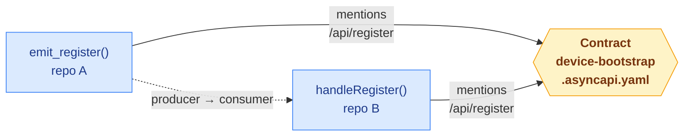

# wiregraph

wiregraph indexes your codebase into a structured graph of its symbols and how they
connect. It makes Claude a better **engineer** on your codebase — not just a better
search box: when it implements a feature, fixes a bug, or refactors, it works from the
full picture (every caller, the real blast radius, cross-repo wiring) instead of a
partial grep — so changes land in the right places. And it gets there reading **about
half as much** (≈40–60% fewer tokens in internal A/B testing), which also means
**faster, cheaper** turns. Everything stays local — the graph is just a file in your
workspace, nothing is uploaded. **Set it up once and forget it.**

📖 **Docs:** <https://kaleletendre.github.io/wiregraph/> — and [what contract architecture is](https://kaleletendre.github.io/wiregraph/contracts.html)



## Contents
- [How it works](#how-it-works)
- [Languages](#languages)
- [Install](#install)
- [Why `node_modules` is committed](#why-node_modules-is-committed)
- [Index a workspace (once)](#index-a-workspace-once)
- [What Claude can do](#what-claude-can-do)
- [Measuring impact](#measuring-impact)
- [Cross-repo connections](#cross-repo-connections) — [contracts in depth](https://kaleletendre.github.io/wiregraph/contracts.html)
- [Roadmap](#roadmap)
- [License](#license)

## How it works



Tree-sitter parses your files into symbols and call sites and stores them in one
per-workspace SQLite file (`<workspace>/.wiregraph/graph.db`). Calls resolve by name
within a repo; cross-repo links go through shared contracts (see
[Cross-repo connections](#cross-repo-connections)). It was built and tested on a real
four-repo workspace wired this way. Edits re-index a file at a time via hooks, so the
graph stays fresh without you touching it.

It's a static, name-based graph, so it's blind to function-pointer/callback dispatch and
string literals, and a C caller list is an upper bound (it can't see `#ifdef`s) — the
tools flag this so Claude verifies when it matters.

**Git is optional.** wiregraph doesn't need it to work — it just walks the folder. When
git *is* present it uses it to spot what changed between sessions for cheap refreshes;
without it, wiregraph still indexes everything and still re-indexes files as you edit
them.

## Languages

| Language | Status |
|---|---|
| C | ✅ supported |
| TypeScript / JavaScript | ✅ supported |
| Python | ✅ supported |
| Java | ✅ supported |
| Kotlin | ✅ supported |
| Go | 🔜 planned |
| Rust | 🔜 planned |
| C++ | 🔜 planned |

## Install

It's a public repo, so anyone can install it straight from Claude Code — no clone,
no account setup. Run these three lines; there's no compile step on mainstream
platforms (Linux/macOS/Windows × x64/arm64; the native bits are prebuilt and vendored):

```
/plugin marketplace add kaleLetendre/wiregraph
/plugin install wiregraph@wiregraph
/reload-plugins
```

When a new version lands, refresh with `/plugin marketplace update wiregraph` then
`/reload-plugins`.

## Why `node_modules` is committed

wiregraph commits its `node_modules/` — unusual enough to look suspicious, so here's
the reason and how to check it yourself.

Claude Code starts a plugin's MCP server the moment the plugin loads, and it does **not**
run `npm install` for you (there's no install-time hook that could run first). If the
dependencies weren't already on disk, the server would fail to start and the tools would
silently be missing. Vendoring them is what makes the plugin work the instant you install
it — no `npm install`, no compile step, on any of Linux/macOS/Windows × x64/arm64. The
only native bits are official `tree-sitter` grammar prebuilds and `sql.js`'s WebAssembly,
at versions pinned in `package-lock.json`.

**You don't have to trust the committed binaries.** The tree is reproducible from the
committed `package-lock.json`, which carries a per-package integrity hash. Replace it with
registry-verified copies and confirm nothing meaningful changed:

```
rm -rf node_modules
npm ci
git status
```

`npm ci` re-fetches every package by its locked integrity hash, so the result is the same
tree from a source you trust (the npm registry), not hand-placed blobs.

**Prefer a repo without vendored dependencies?** Use the
[`no-vendored-deps`](https://github.com/kaleLetendre/wiregraph/tree/no-vendored-deps)
branch — it gitignores `node_modules` and you install deps with `npm install` instead. The
trade-off is a clunkier first run: the MCP tools aren't available until the dependencies
are installed (via `/wiregraph-init`) and you `/reload-plugins`.

## Index a workspace (once)

Run once at the root of a **workspace** — a folder that can hold a single repo or many
side by side:

```
/wiregraph-init
```

That's the whole job — **once per workspace**. It finds every repo under that root and
indexes them into one graph. (If your repos share an **AsyncAPI** contract spec, it also
links likely producers↔consumers across repos through it — a heuristic, opt-in extra.)
It keeps itself current as you edit (set and forget) for everyday work; after a big
refactor or mass rename, run `/wiregraph-rebuild` once to resync. From then on just put
Claude to work — "add an endpoint that does X", "fix this bug", "refactor Y safely",
"what breaks if I change Z" — and it works from the graph instead of guessing from a
partial read.

Rarely needed: `/wiregraph-status` (health + [measured impact](#measuring-impact)),
`/wiregraph-rebuild` (after a big refactor), `/wiregraph-remove` (uninstall from a
workspace).

## What Claude can do

| Tool | Answers |
|---|---|
| `find_symbol` | where something is defined |
| `get_source` | one symbol's body (not the whole file) |
| `trace_callees` / `trace_callers` | what it calls / who calls it — whole tree, one query |
| `trace_contract` / `path_between` | how code connects, across repos, via shared contracts |
| `query_sql` | read-only SQL for anything else |
| `graph_status` / `update_graph` | check freshness / refresh |

You don't call these — Claude does, automatically.

## Measuring impact

Want to see whether it's actually paying off? `/wiregraph-status` ends with a
**Measured impact** rollup, drawn from a local, append-only log
(`<workspace>/.wiregraph/metrics.jsonl` — gitignored, never uploaded):

- **graph-tool usage** — how often Claude reached for the graph instead of grep/Read;
- **tokens saved by `get_source`** — the one symbol body it returned vs. the whole
  file it would otherwise have read (the clean comparison — that's `get_source`'s job);
- **trace coverage** — how many call-tree nodes were answered in a single query;
- **the adoption gap** — greps that searched for a symbol the graph already knew, i.e.
  where it got bypassed.

These are **local estimates under a counterfactual**, on a chars-per-token proxy —
useful for spotting trends and where the graph is being skipped, **not** billed-token
accounting (the ≈40–60% figure at the top of this README comes from controlled A/B
runs, a stronger measurement). Recording is on for any active project and silent when
the posture is `off`; set `WIREGRAPH_METRICS=0` to turn it off entirely.

## Cross-repo connections

Within one repo, wiregraph links calls by name. **Across** repos it won't guess by name
(a shared `start` in two repos would be a false link), so how it bridges depends on how
your repos actually connect.

### Services that talk over the wire (HTTP, queues)

A producer sends a message; a consumer in another repo handles it. There is **no
code-level call** between them — they share only the message *shape*. Code-only analysis
can't connect that, so wiregraph bridges them through that shape, described as an
**AsyncAPI contract**.

**What you provide (opt-in):**

- A directory at the workspace root named `contracts`, `asyncapi`, or `*-contracts`
  (e.g. `api-contracts`) — or pass `--contracts <dir>`.
- Inside it, one or more **AsyncAPI 3.0** specs named `*.asyncapi.yaml` / `*.asyncapi.yml`
  (other files are ignored).
- Nothing if you don't have specs — no contracts dir simply means no cross-repo edges;
  everything else still works.

**What wiregraph does with it:**

1. Reads each spec and extracts its *distinctive* wire tokens — channel/endpoint address
   paths (e.g. `/api/register`) and payload field names (e.g. `device_token`). Low-signal
   names (`id`, `type`, `status`, `data`, …) are filtered out so links stay meaningful.
2. Scans each symbol's body for those tokens; a hit adds a `REFERENCES` edge from that
   symbol to the Contract node.
3. When symbols in **different** repos reference the same token, it joins them
   producer→consumer, taking request/reply direction from the spec's operations.



It's a **heuristic** — "this code mentions a token this contract defines," not "verified
to implement it" — so link quality tracks how distinctive your endpoint/field names are.
Walk the seams with `trace_contract` and `path_between`.

**No specs yet? Infer them.** Run `/wiregraph-contracts` and wiregraph scans the
workspace for HTTP routes one repo *defines* and another repo *calls*, then proposes a
draft AsyncAPI spec wiring them together — review it, and on confirmation it's written
into your contracts dir as a committable artifact. So the cross-repo graph works out of
the box, without hand-writing anything. A contract is really just **defined
communication between two compartments** (services over the wire, a library/SDK's API
surface, or one program reading another's state) — see **[the contract-architecture page](https://kaleletendre.github.io/wiregraph/contracts.html)**
for the full model, the inference flow, and how to author contracts by hand.

### Packages that import each other in-process

In a monorepo where one package imports another, the link is right there in the code (the
`import` / `#include`). wiregraph doesn't follow cross-repo imports yet (on the roadmap
below).

## Roadmap

- **More languages** — Go, Rust, C++ (the 🔜 rows above); each is a grammar
  plus two small rules.
- **Cross-repo imports** — follow `import` / `#include` across packages, so in-process
  cross-repo links work without needing a contract.
- **More contract inference** — contract inference from code shipped for HTTP routes
  (`/wiregraph-contracts`); next are queues/topics, library/SDK API surfaces, and
  shared-state schemas as additional sources onto the same contract machinery.
- **Contract maintenance** — flag drift / cross-service breaking changes when a payload
  field or endpoint changes on one side of a contract but not the other.

## License

[GNU AGPL-3.0-or-later](LICENSE). Copyleft: you're free to use, study, modify, and
share it, but distributing it — or running a modified version as a network service —
means making your source available under the same license. (Licensing may change
later.)
