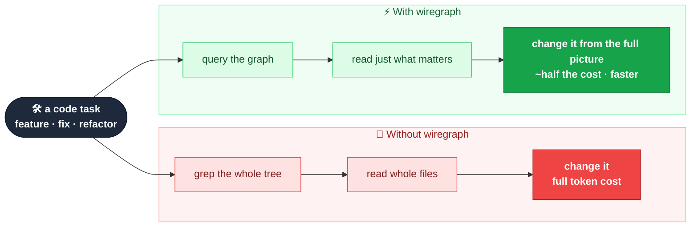
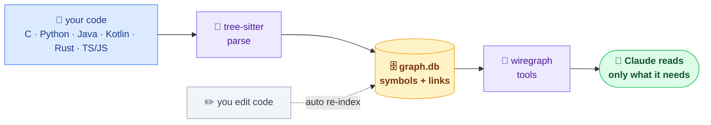
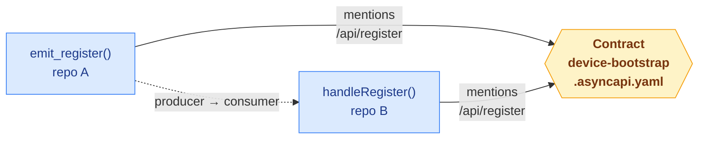

# wiregraph

wiregraph indexes your codebase into a structured graph of its symbols and how they
connect. It makes Claude a better **engineer** on your codebase — not just a better
search box: when it implements a feature, fixes a bug, or refactors, it works from the
full picture (every caller, the real blast radius, cross-compartment wiring) instead of a
partial grep — so changes land in the right places. And it gets there reading **far
less** — returning one symbol, or a whole call-tree, in a single query instead of
full-file reads and repeated greps. On navigation-heavy work that's **roughly half
the file bytes** a grep-and-read would pull; `/wiregraph-stats` measures it locally
per project as an upper-bound estimate. That means **faster, cheaper** turns.
Everything stays local — the graph is just a file in your workspace, nothing is
uploaded. **Set it up once and forget it.**

📖 **Docs:** <https://kaleletendre.github.io/wiregraph/> — and [what contract architecture is](https://kaleletendre.github.io/wiregraph/contracts.html)


```mermaid
flowchart LR
  Q(["🛠️ a code task<br/>feature · fix · refactor"]):::q --> a1
  Q --> b1
  subgraph WO["🐢 Without wiregraph"]
    direction TB
    a1["grep the whole tree"]:::bad --> a2["read whole files"]:::bad --> a3["change it<br/><b>full token cost</b>"]:::badout
  end
  subgraph WI["⚡ With wiregraph"]
    direction TB
    b1["query the graph"]:::good --> b2["read just what matters"]:::good --> b3["change it from the full picture<br/><b>~half the cost · faster</b>"]:::goodout
  end
  classDef q fill:#1e293b,stroke:#0f172a,color:#f8fafc,font-weight:bold
  classDef bad fill:#fee2e2,stroke:#ef4444,color:#7f1d1d
  classDef badout fill:#ef4444,stroke:#b91c1c,color:#ffffff,font-weight:bold
  classDef good fill:#dcfce7,stroke:#22c55e,color:#14532d
  classDef goodout fill:#16a34a,stroke:#15803d,color:#ffffff,font-weight:bold
  style WO fill:#fef2f2,stroke:#fca5a5,color:#991b1b
  style WI fill:#f0fdf4,stroke:#86efac,color:#166534
```

## Contents
- [How it works](#how-it-works)
- [Languages](#languages)
- [Install](#install)
- [Why `node_modules` is committed](#why-node_modules-is-committed)
- [Index a workspace (once)](#index-a-workspace-once)
- [What Claude can do](#what-claude-can-do)
- [Measuring impact](#measuring-impact)
- [Cross-compartment connections](#cross-compartment-connections) — [contracts in depth](https://kaleletendre.github.io/wiregraph/contracts.html)
- [Nested compartments (recursive mode)](#nested-compartments-recursive-mode)
- [Roadmap](#roadmap)
- [License](#license)

## How it works


```mermaid
flowchart LR
  src["📁 your code<br/>C · Python · Java · Kotlin · Rust · TS/JS"]:::src --> ts["🌳 tree-sitter<br/>parse"]:::proc --> db[("🗄️ graph.db<br/>symbols + links")]:::store
  db --> mcp["🔧 wiregraph<br/>tools"]:::proc --> claude(["🤖 Claude reads<br/>only what it needs"]):::ai
  edit["✏️ you edit code"]:::edit -. auto re-index .-> db
  classDef src fill:#dbeafe,stroke:#3b82f6,color:#1e3a8a
  classDef proc fill:#ede9fe,stroke:#8b5cf6,color:#4c1d95
  classDef store fill:#fef3c7,stroke:#f59e0b,color:#78350f,font-weight:bold
  classDef ai fill:#dcfce7,stroke:#22c55e,color:#14532d,font-weight:bold
  classDef edit fill:#f1f5f9,stroke:#94a3b8,color:#334155
```

Tree-sitter parses your files into symbols and call sites and stores them in one
per-workspace SQLite file (`<workspace>/.wiregraph/graph.db`). Calls resolve by name
within a compartment; cross-compartment links go through shared contracts (see
[Cross-compartment connections](#cross-compartment-connections)). It was built and tested on a real
four-service workspace wired this way. Edits re-index a file at a time via hooks, so the
graph stays fresh without you touching it.

It's a static, name-based graph, so it's blind to function-pointer/callback dispatch and
string literals, and a C caller list is an upper bound (it can't see `#ifdef`s) — the
tools flag this so Claude verifies when it matters.

**Git is optional.** wiregraph doesn't need it to work — it just walks the folder. When
git *is* present it uses it to spot what changed between sessions for cheap refreshes;
without it, wiregraph still indexes everything and still re-indexes files as you edit
them.

## Languages

| Language | Status |
|---|---|
| C | ✅ supported |
| TypeScript / JavaScript | ✅ supported |
| Python | ✅ supported |
| Java | ✅ supported |
| Kotlin | ✅ supported |
| Rust | ✅ supported |
| Go | 🔜 planned |
| C++ | 🔜 planned |

## Install

It's a public repo, so anyone can install it straight from Claude Code — no clone,
no account setup. Run these three lines; there's no compile step on mainstream
platforms (Linux/macOS/Windows × x64/arm64; the native bits are prebuilt and vendored):

```
/plugin marketplace add kaleLetendre/wiregraph
/plugin install wiregraph@wiregraph
/reload-plugins
```

When a new version lands, refresh with `/plugin marketplace update wiregraph` then
`/reload-plugins`.

## Why `node_modules` is committed

wiregraph commits its `node_modules/` — unusual enough to look suspicious, so here's
the reason and how to check it yourself.

Claude Code starts a plugin's MCP server the moment the plugin loads, and it does **not**
run `npm install` for you (there's no install-time hook that could run first). If the
dependencies weren't already on disk, the server would fail to start and the tools would
silently be missing. Vendoring them is what makes the plugin work the instant you install
it — no `npm install`, no compile step, on any of Linux/macOS/Windows × x64/arm64. The
only native bits are official `tree-sitter` grammar prebuilds and `sql.js`'s WebAssembly,
at versions pinned in `package-lock.json`.

**You don't have to trust the committed binaries.** The tree is reproducible from the
committed `package-lock.json`, which carries a per-package integrity hash. Replace it with
registry-verified copies and confirm nothing meaningful changed:

```
rm -rf node_modules
npm ci
git status
```

`npm ci` re-fetches every package by its locked integrity hash, so the result is the same
tree from a source you trust (the npm registry), not hand-placed blobs.

**Prefer a repo without vendored dependencies?** Use the
[`no-vendored-deps`](https://github.com/kaleLetendre/wiregraph/tree/no-vendored-deps)
branch — it gitignores `node_modules` and you install deps with `npm install` instead. The
trade-off is a clunkier first run: the MCP tools aren't available until the dependencies
are installed (via `/wiregraph-init`) and you `/reload-plugins`.

## Index a workspace (once)

Run once at the root of a **workspace** — a folder that can hold a single repo or many
side by side:

```
/wiregraph-init
```

That's the whole job — **once per workspace**. It finds every compartment under that root
and indexes them into one graph. (If your compartments share an **AsyncAPI** contract spec,
it also links likely producers↔consumers across compartments through it — a heuristic, opt-in extra.)
It keeps itself current as you edit (set and forget) for everyday work; after a big
refactor or mass rename, run `/wiregraph-rebuild` once to resync. From then on just put
Claude to work — "add an endpoint that does X", "fix this bug", "refactor Y safely",
"what breaks if I change Z" — and it works from the graph instead of guessing from a
partial read.

Rarely needed: `/wiregraph-status` (health + [measured impact](#measuring-impact)),
`/wiregraph-rebuild` (after a big refactor), `/wiregraph-remove` (uninstall from a
workspace).

## What Claude can do

| Tool | Answers |
|---|---|
| `find_symbol` | where something is defined |
| `get_source` | one symbol's body (not the whole file) |
| `trace_callees` / `trace_callers` | what it calls / who calls it — whole tree, one query |
| `trace_contract` / `path_between` | how code connects, across repos, via shared contracts |
| `query_sql` | read-only SQL for anything else |
| `graph_status` / `update_graph` | check freshness / refresh |

You don't call these — Claude does, automatically.

**Read a whole flow at once.** `/wiregraph-linearize <Class.method>` follows the `CALLS`
graph from one symbol and inlines every reachable body **once**, in reading order, into a
single top-to-bottom pseudo-source file — a feature smeared across many files read like a
script. It's a reading aid (the output doesn't compile) and works across compartments and
languages. Narrow or widen with `--breadth tight|medium|full` and `--depth N`.

## Measuring impact

Want to see whether it's actually paying off? `/wiregraph-status` ends with a
**Measured impact** rollup, drawn from a local, append-only log
(`<workspace>/.wiregraph/metrics.jsonl` — gitignored, never uploaded):

- **graph-tool usage** — how often Claude reached for the graph instead of grep/Read;
- **tokens saved by `get_source`** — the one symbol body it returned vs. the whole
  file it would otherwise have read (the clean comparison — that's `get_source`'s job);
- **trace coverage** — how many call-tree nodes were answered in a single query;
- **the adoption gap** — greps that searched for a symbol the graph already knew, i.e.
  where it got bypassed.

These are **local estimates under a counterfactual**, on a chars-per-token proxy —
useful for spotting trends and where the graph is being skipped, **not** billed-token
accounting. The "about half" figure is an **upper-bound** estimate against reading
whole files; it does not yet net out wiregraph's own per-turn context cost (the
CLAUDE.md directive + MCP tool schemas the model carries each turn), which
`/wiregraph-stats` now shows alongside it. Treat it as a directional trend, not a
guarantee. Recording is on for any active project and silent when the posture is
`off`; set `WIREGRAPH_METRICS=0` to turn it off entirely.

## Cross-compartment connections

Within one compartment, wiregraph links calls by name. **Across** compartments it won't
guess by name (a shared `start` in two compartments would be a false link), so how it
bridges depends on how your compartments actually connect.

There are **three contract types**, and one idea underneath all of them: each joins the two
sides on **a shared identifier that appears literally in both compartments' source** — a
route or topic for a wire, a constant name for a resource, a symbol name for an in-process
seam. That is why none of them needed a new extractor and why all three work in **every
language wiregraph indexes**: the matcher looks for a string you already wrote down, and
mints a `REFERENCES` edge from whichever symbol encloses it. It is also the shared limit —
a seam whose two sides never spell the same thing is a seam wiregraph cannot see, whatever
the spec says.

| Type | File | Joins on | Roles | Derived edge |
|---|---|---|---|---|
| **wire** | `*.asyncapi.yaml` | a channel address / topic, and payload field names | producer → consumer | `WIRE` |
| **resource** | `*.resource.yaml` | the shared **constant name** | writer → reader | `RESOURCE` |
| **in-process** | `*.inproc.yaml` | the exported **symbol name** | provider → consumer | `INPROC` |

### Services that talk over the wire (HTTP, queues)

A producer sends a message; a consumer in another compartment handles it. There is **no
code-level call** between them — they share only the message *shape*. Code-only analysis
can't connect that, so wiregraph bridges them through that shape, described as an
**AsyncAPI contract**.

**What you provide (opt-in):**

- A directory at the workspace root named `contracts`, `asyncapi`, or `*-contracts`
  (e.g. `api-contracts`) — or pass `--contracts <dir>`.
- Inside it, one or more **AsyncAPI** specs named `*.asyncapi.yaml` / `*.asyncapi.yml`
  (2.x and 3.x are both read), and/or **resource contracts** named `*.resource.yaml`
  for coupling through a shared file, socket, table or shared-memory region, and/or
  **in-process contracts** named `*.inproc.yaml` for two compartments in one process
  (other files are ignored).
- Nothing if you don't have specs — no contracts dir simply means no cross-compartment edges;
  everything else still works.

**What wiregraph does with it:**

1. Reads each spec and extracts its *distinctive* wire tokens — channel/endpoint address
   paths (e.g. `/api/register`) and payload field names (e.g. `device_token`). Low-signal
   names (`id`, `type`, `status`, `data`, …) are filtered out so links stay meaningful.
2. Scans each symbol's body for those tokens; a hit adds a `REFERENCES` edge from that
   symbol to the Contract node.
3. When symbols in **different** compartments reference the same token, it joins them
   producer→consumer, taking request/reply direction from the spec's operations.


```mermaid
flowchart LR
  A["emit_register()<br/>repo A"]:::r -- mentions<br/>/api/register --> C{{"Contract<br/>device-bootstrap<br/>.asyncapi.yaml"}}:::c
  B["handleRegister()<br/>repo B"]:::r -- mentions<br/>/api/register --> C
  A -. producer → consumer .-> B
  classDef r fill:#dbeafe,stroke:#3b82f6,color:#1e3a8a
  classDef c fill:#fef3c7,stroke:#f59e0b,color:#78350f,font-weight:bold
```

It's a **heuristic** — "this code mentions a token this contract defines," not "verified
to implement it" — so link quality tracks how distinctive your endpoint/field names are.
Walk the seams with `trace_contract` and `path_between`.

**No specs yet? Infer them.** Run `/wiregraph-contracts` and wiregraph scans the
workspace for HTTP routes one compartment *defines* and another *calls*, then proposes a
draft AsyncAPI spec wiring them together — review it, and on confirmation it's written
into your contracts dir as a committable artifact. The inferred spec also records which
compartment *produces* vs *consumes* each seam, so directional producer→consumer `WIRE`
edges are derived automatically — no `WIREGRAPH_SERVER_REPO` needed (that env var is only
a fallback for hand-written specs that omit the direction). So the cross-compartment graph
works out of the box, without hand-writing anything. A contract is really just **defined
communication between two compartments** (services over the wire, a library/SDK's API
surface, or one program reading another's state) — see **[the contract-architecture page](https://kaleletendre.github.io/wiregraph/contracts.html)**
for the full model, the inference flow, and how to author contracts by hand.

### Crates and modules coupled inside one process

Two compartments in **one binary**, on either side of a crate or module wall, coupled by
direct use of each other's exported symbols — an `ecs` crate whose `World` and `Scheduler`
the `sim` crate builds on. There is no wire and no shared file, and — as above — wiregraph
never resolves a call across a compartment boundary by name, so without a contract a
four-crate Cargo workspace indexes as four disconnected islands.

The join key is the one thing both sides already spell identically: **the exported symbol
name**. Describe the seam in a `<name>.inproc.yaml` in the same contracts dir:

```yaml
title: ecs-sim                 # -> contract name; UNIQUE across every spec, in all formats
boundary: crate                # crate | module — documentation of what the seam crosses
symbols:
  - id: World                  # the exported SYMBOL NAME, bare — not ecs::World, not World<T>
    kind: type                 # type | function | method | trait | macro — descriptive only
    provider: ecs              # the ONE compartment that defines it
    consumers: [sim]           # the compartments that use it
  - id: Scheduler
    kind: type
    provider: ecs
    consumers: [sim]
```

That derives directed `INPROC` edges from provider symbols to consumer symbols, and
`trace_contract` / `path_between` walk them like any other seam. **Direction is one-way by
construction** — exactly one `provider`, and a spec naming one compartment as both provider
and consumer of a symbol is refused rather than warned about.

**Read the drift report asymmetrically — this is the part that bites.** An in-process id is
usually a short name (`World`, `Entity`), matched literally and case-sensitively as
`\bWorld\b` across both compartments:

- 🔴 **`unreferenced` is strong evidence.** Nothing anywhere in scope spells the name, so
  either the symbol is gone or the spec is stale. Act on it.
- ✅ **`satisfied` is weak.** It means *both compartments spell this name*, not *the consumer
  uses the provider's one*. Comments and `use`/`import` lines are excluded, but an unrelated
  same-named symbol inside a declared compartment is indistinguishable from the real use, and
  a re-export under a different local name (`use ecs::World as W`), a type alias or a
  macro-pasted name is missed entirely.
- **The blast radius is bounded by the declared roles.** Only symbols in the declared
  `provider` compartment are paired with symbols in the declared `consumers`, so a stray
  `World` in a third crate can **never** mint an `INPROC` edge. It surfaces instead as an
  ⚠️ **undeclared participant** — "something else in this project spells this name, go look."

**These are hand-written only.** `/wiregraph-contracts` infers wire and resource seams; it
never proposes an `*.inproc.yaml`, so there is no draft to wait for. Write it and run
`/wiregraph-rebuild`.

### Packages that import each other in-process

In a monorepo where one package imports another, the link is right there in the code, and
wiregraph resolves it into an `IMPORTS` edge (module → module) that `path_between` traverses like
any other. That resolution covers **TypeScript/JavaScript** — a relative specifier, or a bare one
matching another compartment's `package.json` `name` — and **C**'s quoted `#include "…"`.
**Python, Java, Kotlin and Rust emit no import candidates at all**, so nothing is resolved for
them: a Rust `use` path names a crate-relative *namespace*, not a file, and guessing which file it
lands on would mint a false edge. For those languages an in-process cross-compartment link is
either described by an [in-process contract](#crates-and-modules-coupled-inside-one-process) or
absent from the graph.

## Nested compartments (recursive mode)

Most projects are one flat set of compartments with one `contracts/` dir at the root. That's
**global mode**, it's the default, and it's what everything above describes. **Recursive mode** is
the opt-in alternative for a tree whose compartments *nest* — a `server/` split into crates, a
`client/` split into modules, each level with its own `contracts/` directory. `/wiregraph-init` is
the only command that sets the mode; a recursive project then **declares** its compartments (with
the names you choose) in `.wiregraph/state.json` instead of having them inferred from `.git` and
build manifests, and every `contracts/` dir under the root is discovered, not just the depth-1 one.

**A contracts dir governs its parent.** `server/contracts/` applies to files under `server/` and
nowhere else; the root's `contracts/` applies to the whole tree. Where an outer and an inner
contract declare the same token, the innermost one containing the file wins, and the outer
contract's `trace_contract` report says that token is **shadowed** — not missing, nothing to fix.
Two specs sharing an `info.title` across different scopes would merge into one node and erase both
scopes, so that collision is refused by name, keeping the outer spec.

### The architecture it implements

Recursive mode was built for a written, tool-independent architecture — **Compartments &
Contracts** — that wiregraph did not invent: a *compartment* owns one job and carries a short
`whoami.md` saying what it owns and what it must not know about; a *contract* is a document naming
exactly two compartments and what crosses between them; contracts live in the shared parent's
`contracts/` directory; the set of contracts is the complete list of communication paths in the
system. Its rules are numbered R1–R6. The document itself lives with the project that applies it,
not in this repo — wiregraph is one possible implementation of part of it, and the table below is
the honest account of which part.

wiregraph implements the placement rule, checks two others, quietly relies on two more, and does
nothing at all about the last one. Which is which:

| Rule | What wiregraph does about it | Verdict |
|---|---|---|
| **R1** — a contract names exactly two sides | Roles are lists (`x-wiregraph-producers` / `x-wiregraph-consumers`, or a resource's `writers` / `readers`). Nothing counts sides: a spec naming three compartments loads and derives edges among all of them. | **unaddressed** |
| **R2** — where several compartments implement one side, name *roles*, not directories | Exactly the shape of those role lists — one contract, two roles, many compartment names per role. Not checked: split it into one contract per implementation and nothing complains, but if the copies then sit at different levels the scope rule above hands the shared token to the innermost one and the others report one-sided. | **assumed** |
| **R3** — if two compartments don't communicate, there is no file | `trace_contract` diffs a contract's whole declared token set against the code every call: a token nothing references is 🔴 drift, a token only one side references is ⚠️ one-sided. The converse — communication with *no* contract — is what `/wiregraph-contracts` infers, and a project with seams and no hand-written contracts dir is nudged toward it at session start. | **enforced** |
| **R4** — a contract lives in the shared parent's `contracts/`, never inside either side | This *is* recursive mode's scope rule: the subtree a contract governs is the parent of the directory holding it (`scopeRoot = dirname(dir)`, `src/contracts-dirs.js`). File a contract inside one of its own sides and it governs only that side; the other side's references fall outside its scope and its tokens report one-sided. Detected — though reported as a missing half, not named as a misfiling. | **enforced** |
| **R5** — a contract names only siblings | Role names are matched against a **flat** partition: every file belongs to its *nearest* declared compartment, so a parent whose children are compartments in their own right holds only the files that are in none of them. Name `server` as a role when the code lives in `server/ecs`, `server/sim`, … and it matches almost nothing — no `WIRE` edge, a one-sided report, no message saying why. Name the leaf compartments instead. | **assumed** |
| **R6** — direction is one-way where it can be | An **in-process contract** is the one place this is checkable, and it is checked: a symbol has exactly one `provider`, and a spec naming a compartment as both provider and consumer of the same symbol is **refused at load**, with the reason. Nothing else is. `WIRE` edges are directed producer → consumer, but that is message flow, not dependency structure, and nothing looks for a *cycle* — not among contracts, not over `IMPORTS`. So the rule is enforced per declaration, never system-wide. | **enforced** (per declaration) |

**enforced** = wiregraph detects a violation and says so. **assumed** = its behaviour depends on the
rule holding, and goes quiet or wrong if it doesn't. **unaddressed** = nothing in wiregraph relates
to it. A rule wiregraph doesn't check is not a rule that stopped mattering; three of the six are
still enforced only by review, and R6's check covers only what a single spec can contradict —
never a cycle across several.

### What it can't express

**A seam whose two sides never name the same thing.** An in-process contract joins on the
exported symbol name, so it covers the common case — one crate defines `World`, another uses it.
It does **not** cover two compartments that are wired together by a *third* one and never mention
each other at all: `sim` handing tick output to `network` over a channel that `host` constructs
puts no shared identifier in either side's source, so there is nothing to join on and no spec can
invent one. Nor should that be filed as a resource contract — a resource's join key is a constant
naming a *thing outside both compartments*, and an in-memory channel has no such thing. The fix is
the same discipline as for a hand-packed binary protocol (below): give the payload a **named type
both sides spell**, and declare that name. Until they share a string, the
graph honestly holds two crates with no edge between them.

**Only three file types in a `contracts/` dir are read** — `*.asyncapi.yaml` (wire),
`*.resource.yaml` (resource) and `*.inproc.yaml` (in-process). Everything else in there is
ignored, deliberately and silently. If
your contracts are prose documents, they stay prose documents: the YAML spec beside them is a
machine-readable projection of the part that can be string-matched, not a replacement for the
document, and the two have to be kept honest by hand.

**And matching needs a shared string.** A contract's tokens are channel addresses and payload field
names; wiregraph mints an edge when it finds one of those written literally in a symbol's body.
A protocol that puts nothing quotable in the code — hand-packed bits over a socket, integer message
tags, a generated codec — matches nothing, and the contract reports as drift on both sides. The fix
is a discipline rather than a setting: give each message type a **named constant that both sides
spell the same way**, and use it. The
[contract-architecture page](https://kaleletendre.github.io/wiregraph/contracts.html) works an
example through, including the part people get wrong (a constant that is only *declared* on one
side doesn't count — declaration sites are excluded on purpose).

## Roadmap

- **More languages** — Go, C++ (the 🔜 rows above); each is a grammar
  plus two small rules.
- **Cross-compartment imports, for the rest of the languages** — `IMPORTS` edges resolve today for
  TS/JS specifiers and C's quoted `#include`; Python, Java, Kotlin and Rust emit no import
  candidates, so their in-process cross-compartment links need a contract or go unlinked. Rust
  needs a `mod`/`Cargo.toml` resolver before a `use` path can name a file.
- **More contract inference** — contract inference from code shipped for HTTP routes and shared
  constants (`/wiregraph-contracts`); next are queues/topics, library/SDK API surfaces, and
  **in-process seams**, which are hand-written only today — nothing proposes an `*.inproc.yaml`.
- **Letting an in-process contract authorize call resolution** — today an `INPROC` edge means
  "both compartments spell this declared symbol", not "this call resolves to that definition".
  Teaching `resolve.js` to link calls across a compartment boundary *for the symbols a contract
  declares* would turn the declared surface into real `CALLS` edges.
- **Contract maintenance** — flag drift / cross-service breaking changes when a payload
  field or endpoint changes on one side of a contract but not the other.

## License

[GNU AGPL-3.0-or-later](LICENSE). Copyleft: you're free to use, study, modify, and
share it, but distributing it — or running a modified version as a network service —
means making your source available under the same license. (Licensing may change
later.)
