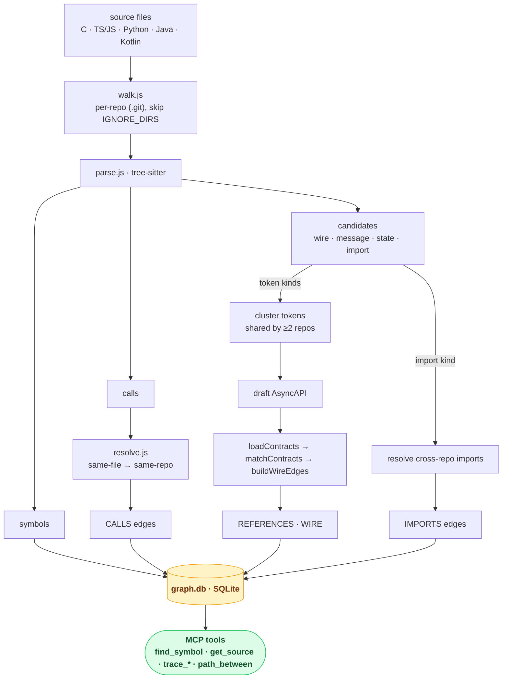
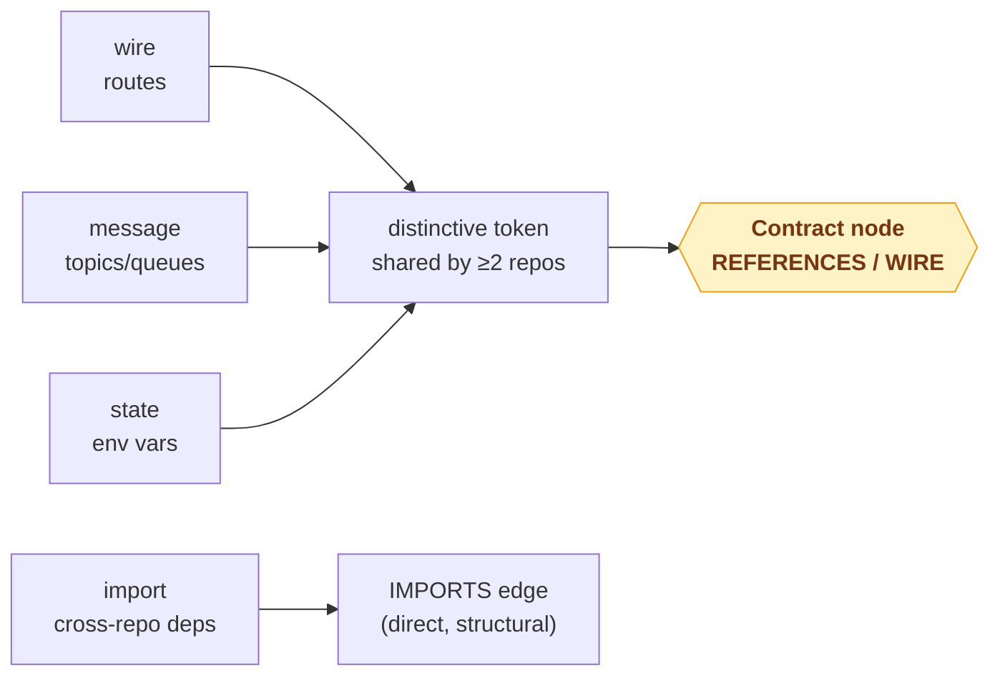

# Architecture

How wiregraph turns a workspace of repos into a queryable graph — and how it links
code *across* repos through contracts. The pipeline is one pass: walk → parse →
resolve → (contracts) → load into SQLite, then serve via MCP tools.

## Stages

**Walk** (`src/extract/walk.js`). Discovers each git repo under the workspace root
and yields every source file tagged with its repo. `IGNORE_DIRS` skips
`node_modules`, build output, and wiregraph's own `.wiregraph`/`.codegraph` state
dirs. Repo attribution is by nearest ancestor `.git`, so a file's edges are scoped
to the right repo.

**Parse** (`src/extract/parse.js`). One tree-sitter pass per file, driven by
per-language rules, produces three things: **symbols** (with exact line spans),
**calls** (callee name + the symbol it sits inside), and **candidates** — the
contract signals described below. The single walk means detection is free: no
second parse.

**Resolve** (`src/extract/resolve.js`). Turns name-based calls into `CALLS` edges,
resolving same-file first, then same-repo. It deliberately **never** resolves a call
across repos by name (a shared `start` in two repos would be a false link) — cross-
repo links come only from contracts and imports, which are explicit.

**Contracts** (`src/extract/contracts.js`, `src/contracts/infer.js`). The cross-repo
layer — see the detector model below.

**Store** (`src/store/sqlite.js`). Everything loads into one embedded SQLite file
(`<workspace>/.wiregraph/graph.db`) via sql.js (WASM) — no daemon, no JVM. Edits
re-index a file at a time; reads self-heal stale files before answering.

**Serve** (`src/mcp/server.js`). The graph is exposed as question-shaped MCP tools.
You don't call them — Claude does.

## The detector model (contracts)

A **contract** is the defined communication between two compartments (see
[Contracts](contracts.md) for the concept). Mechanically, almost every contract
reduces to *a distinctive token that 2+ repos both reference* — so the contract
layer is a set of **detectors** that each harvest one kind of cross-repo signal,
all feeding the same cluster → synthesize → match pipeline:

| Detector | Signal | Token | Edge |
|---|---|---|---|
| **wire** | HTTP route defs / client calls (Express, FastAPI, fetch, axios) | the path | REFERENCES → Contract |
| **message** | publish/subscribe call sites (AMQP, Kafka, MQTT, NATS, Redis, emit/on) | the topic/queue/subject | REFERENCES → Contract |
| **state** | env-var reads (`process.env`, `os.getenv`, `getenv`) | the var name | REFERENCES → Contract |
| **import** | cross-repo `import`/`require`/`#include` | the resolved target | IMPORTS (direct) *(in progress)* |

Token-based detectors (wire/message/state) cluster their candidates by
`(kind, token)`; any token spanning ≥2 repos becomes a **seam**, synthesized as one
AsyncAPI channel. The generated spec is consumed by the **existing**
`loadContracts`/`matchContracts`/`buildWireEdges` pipeline unchanged — it round-trips
because the channel `address` is exactly what `collectTokens` reads back (a path is
trimmed to a `{param}`-free prefix; a non-path topic is matched literally). The
import detector is structural instead: it resolves the dependency directly into a
cross-repo `IMPORTS` edge.

Noise control is deliberate: detection is scoped to specific syntactic positions
(route verbs, pub/sub methods, env access), tokens must pass a **distinctiveness**
filter (`isDistinctive`: paths, dotted topics, snake/ENV names, long identifiers —
common words and ubiquitous env vars are filtered), and a token only becomes a seam
if **≥2 distinct repos** share it. Inferred contracts are **proposed, never silently
written** (`/wiregraph-contracts` shows them for review) and every heuristic edge
carries an `evidence` tag.

## Edge & evidence types

| Edge | From → To | Meaning |
|---|---|---|
| `IN_REPO` | file → repo | file membership |
| `DEFINED_IN` | symbol → file | where a symbol lives |
| `CALLS` | symbol → symbol | a resolved call (in-repo) |
| `REFERENCES` | symbol → contract | code mentions a contract token (`evidence: contract-match`) |
| `WIRE` | symbol → symbol | derived producer→consumer across a contract (`evidence: wire-derived`) |
| `IMPORTS` | symbol/file → symbol/file | cross-repo dependency (explicit import) *(in progress)* |

## Blind spots (by design)

The graph is static and name-based, so it is blind to: **function-pointer / callback
dispatch**; **string literals** it doesn't specifically harvest; and the **C
preprocessor** (it counts call sites inside disabled `#ifdef`/`#if 0` blocks, so a C
caller list is an upper bound). The tools surface these caveats so Claude verifies
when it matters.
