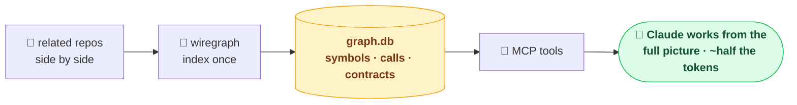

# wiregraph

**A cross-repo call + contract graph for AI coding agents.** wiregraph indexes your
codebase — and the seams *between* your repos — into a structured graph, exposed to
Claude as MCP tools. Claude navigates, audits, and refactors from the full picture
(every caller, the real blast radius, cross-repo wiring) while reading **~40–60%
fewer tokens** than grep + Read. Everything stays local: the graph is a single
SQLite file in your workspace, nothing is uploaded.



## Start here

- **[Contracts: connecting two compartments](contracts.md)** — what a contract is
  (it's *not* just microservices), the variety of boundaries wiregraph detects, and
  how to infer or hand-author them.
- **[Architecture](architecture.md)** — how the whole pipeline works: walk → parse →
  resolve → contracts → graph → MCP tools, the detector model, and the edge types.

## Install

```
/plugin marketplace add kaleLetendre/wiregraph
/plugin install wiregraph@wiregraph
/reload-plugins
```

Then index a workspace once — put related repos side-by-side under one folder and:

```
/wiregraph-init
```

## What Claude can do

| Tool | Answers |
|---|---|
| `find_symbol` | where something is defined |
| `get_source` | one symbol's body (not the whole file) |
| `trace_callers` / `trace_callees` | who calls it / what it calls — whole tree, one query |
| `trace_contract` / `path_between` | how code connects, across repos, via shared contracts |
| `query_sql` | read-only SQL for anything else |

Plus `/wiregraph-contracts` to infer cross-repo contracts from code, and
`/wiregraph-stats` to see the tokens the graph has saved you.

The source lives at [github.com/kaleLetendre/wiregraph](https://github.com/kaleLetendre/wiregraph).
